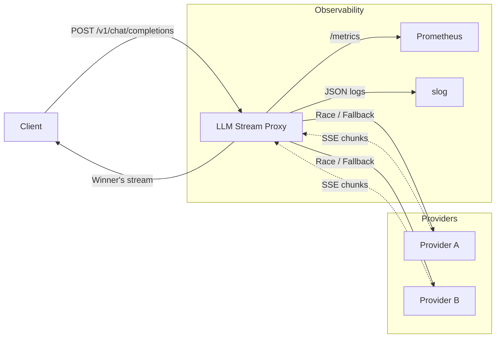

# LLM Inference Multiplexer & Streaming Proxy

A high-performance Go reverse proxy that multiplexes streaming LLM requests across multiple AI providers, optimizing for **first-token latency** using Go's context cancellation.

## Architecture



## Features

- **Race Mode:** Fires requests to all providers concurrently, streams from whichever responds first, instantly cancels the rest via `context.WithCancel`
- **Fallback Mode:** Tries providers in priority order, falls back on rate limits (429) or errors
- **OpenAI-Compatible API:** Drop-in replacement — any OpenAI client SDK works
- **SSE Streaming:** Real-time token-by-token streaming with proper HTTP flushing
- **Mock Providers:** Zero-config demo mode with configurable latencies — no API keys needed
- **Real Providers:** OpenAI, Anthropic (with format translation), Ollama
- **Prometheus Metrics:** Request counts, duration histograms, first-token latency, provider errors
- **Structured Logging:** JSON-formatted `log/slog` output
- **Graceful Shutdown:** Clean connection draining on SIGTERM

## Quick Start

```bash
# Clone and run with mock providers (zero config needed)
go run main.go

# In another terminal — verify streaming with curl
curl -N -X POST http://localhost:8080/v1/chat/completions \
  -H "Content-Type: application/json" \
  -d '{"messages":[{"role":"user","content":"hello"}],"stream":true}'
```

The `-N` flag disables output buffering so you can visually verify real-time chunk streaming.

## Configuration

All configuration via environment variables (see [.env.example](.env.example)):

| Variable | Default | Description |
|---|---|---|
| `LISTEN_ADDR` | `:8080` | Server listen address |
| `STRATEGY` | `race` | Routing strategy: `race` or `fallback` |
| `USE_MOCK_PROVIDERS` | `true` | Use built-in mock providers (no API keys needed) |
| `MOCK_A_LATENCY` | `20ms` | Mock provider A time-to-first-token |
| `MOCK_B_LATENCY` | `80ms` | Mock provider B time-to-first-token |
| `OPENAI_API_KEY` | — | OpenAI API key (activates OpenAI provider) |
| `ANTHROPIC_API_KEY` | — | Anthropic API key (activates Anthropic provider) |
| `OLLAMA_ENDPOINT` | `http://localhost:11434` | Ollama endpoint |

## Testing

### Unit & Integration Tests
```bash
make test
```

### Race Detector Verification
```bash
make test-race
```
All concurrent channel operations and context cancellation logic is verified race-free.

### Load Testing
```bash
# Start the server
make run

# In another terminal
make bench
```

## Design Decisions

- **No `net/http/httputil.ReverseProxy`** — The race/fallback multiplexing logic requires custom goroutine orchestration that doesn't fit the single-upstream ReverseProxy model.
- **`sync.Once` for winner selection** — Ensures race-free winner determination without complex mutex locking.
- **All providers normalize to OpenAI chunk format** — The handler is completely provider-agnostic.
- **Single external dependency** — Only `prometheus/client_golang`. Everything else is Go standard library.

## Project Structure

```
├── main.go                  # Server setup, graceful shutdown
├── config/config.go         # Environment-based configuration
├── proxy/
│   ├── provider.go          # Provider interface + error types
│   ├── multiplexer.go       # Race + Fallback orchestration
│   ├── handler.go           # HTTP handler (OpenAI-compatible)
│   └── sse.go               # SSE reader/writer utilities
├── provider/
│   ├── mock.go              # Mock provider (configurable latency)
│   ├── openai.go            # OpenAI streaming client
│   ├── anthropic.go         # Anthropic with format translation
│   └── ollama.go            # Ollama (OpenAI-compat)
├── metrics/metrics.go       # Prometheus counters + histograms
└── testutil/mock_server.go  # Test utility for fake SSE servers
```
